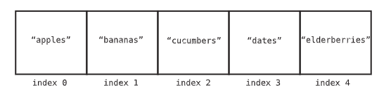

---
tags:
  - data-structures
  - CS
  - "#dsa"
  - "#arrays"
date: 2023-11-20
---
## What is an Array?

- The most fundamental idea of an array is that it is a contiguous memory space. Contiguous meaning unbreaking memory space in which contains a certain amount of bytes.
### Terms associated with arrays
- Size: number of data elements it can store
- Index: number that identifies where a piece of fata lives inside the array
	- index for any array starts at 0
	

## Operations on an Array

- The following operations are the four basic ways to interact with an array or any data structure for that matter:
	1. Read: looking something up at a particular spot within the data structure.
	2. Search: looking for a specific value within the data structure when the exact location/index of the value is unknown.
	3. Insert: adding a new value to an additional slot within the data structure.
	4. Delete: removing a value from the data structure.

## Advantages of using an array

- Arrays allow random access to elements if the index of the value needed is known to us which makes the lookup time to be O(1).
- Arrays store multiple items of the same datatype.

## Disadvantages of using an array

- Arrays in most programming languages are of static type that means once an array is initialized with size then the array size cannot be changed.