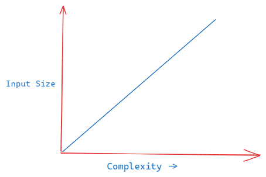

> #algorithms #bigO #CS #data-structures 

Before learning about algorithms we need to learn about a concept called Big O. This is how we measure or explain the time and performance of our algorithms.


## What is Big O?

- Big O is a **way to categorize your algorithms time** or memory requirements based on input.
- It is not meant to be an exact measurements, instead it is meant to generalize the growth of your algorithm.
- For example, when someone says O(N) (Oh of n) they mean your algorithm will grow linearly based on the input.
## Why do we use it?

1. To make good decisions on which data structures and algorithms to use.
2. Knowing how an algorithm will perform with different parameters helps us in creating the best possible program that runs fast and doesn't use too much memory.

## Important Concepts

> 1. growth is with respect to the input.
> 2. Constants are dropped
> 3. Worst case is usually the way we measure

### 1. Growth is with respect to the input

- Memory is not computationally free and if we don't take the memory consumption into account when thinking in terms of algorithms then the penalty for not thinking about this increases as the input size grows.
- In languages like Go or JavaScript we would have to pay even heavier penalties because the memory can be kept around, grows faster and causes complete halts in our program for cleanup.
### 2. Constants are dropped

- O(2N) -> O(N): We can present an O(2N) complexity as O(N) as Big O notations are meant to describe the upper bound of the algorithm(the growth of the algorithm). The constant eventually becomes irrelevant.

| Input Size | O(10N)                   | O(N^2)                                |
| ---------- | ------------------------ | ------------------------------------- |
| N = 1      | 10 x 1 = 10              | 1 ^ 2 = 1                             |
| N = 5      | 10 x 5 = 50              | 5 ^ 2 = 25                            |
| N = 100    | 10 x 100 = 1,000         | 100 ^ 2 = 10,000 `// 10x bigger`      |
| N = 1000   | 10 x 1000 = 10,000       | 1000 ^ 2 = 1,000,000 `// 100x bigger` |
| N = 10000  | 10 x 10000 = 100,000 | 10000 ^ 2 = 100,000,000 `// 1000x bigger`                                      |

> **NOTE**
> There is practical vs theoretical differences. Just because N is faster than N ^ 2 doesn't mean practically its always faster for smaller input.

### 3. Worst case is usually the we measure

- Since 'worst' scenario explains the worst possible time and space complexity of a program/algorithm therefore people usually only ask for the worst case complexity.
## Example program

```typescript
function sum_char_codes(n: string): number {
	let sum = 0;
	for (let i = 0; i < n.length; i++) {
		sum += n.charCodeAt(i);
	}
	return sum;
}
```
- The run time for the code snippet above is O(N). Here is the reasons why:
	- There is a single for loop that goes over the string 'n' and adds till the length of the string.
	- If the string is of length 5 the loop runs 5 times, if the length is 10 then the loop runs 10 times and so on.
	- This shows a linear growth in the time and space complexity and is donated by O(N)
	  
   

#### Some more examples

- O(N)
```typescript
function sum_char_codes(n: string): number {
	let sum = 0;
	for (let i = 0; i < n.length; i++) {
		sum += n.charCodeAt(i);
	}
	
	for (let i = 0; i < n.length; i++) {
		sum += n.charCodeAt(i);
	}
	return sum;
}
```

- O(N^2)

```typescript
function sum_char_codes(n: string): number {
	let sum = 0;
	for (let i = 0; i < n.length; i++) {
		for (let j = 0; j < n.length; j++) {
			sum += n.charCodeAt(i);
		}
	}
	return sum;
}
```

- O(N^3)
```typescript
function sum_char_codes(n: string): number {
	let sum = 0;
	for (let i = 0; i < n.length; i++) {
		for (let j = 0; j < n.length; j++) {
			for (let k = 0; k < n.length; k++) {
				sum += n.charCodeAt(i);
			}
		}
	}
	return sum;
}
```
